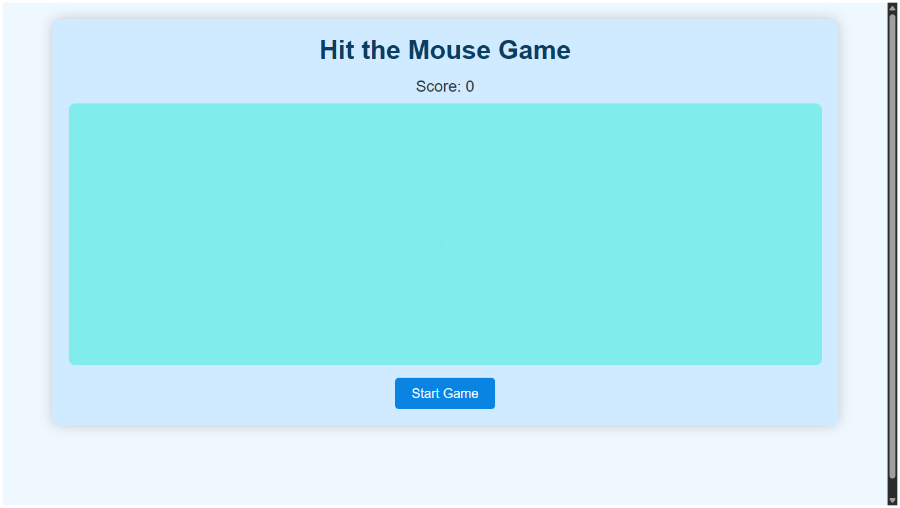
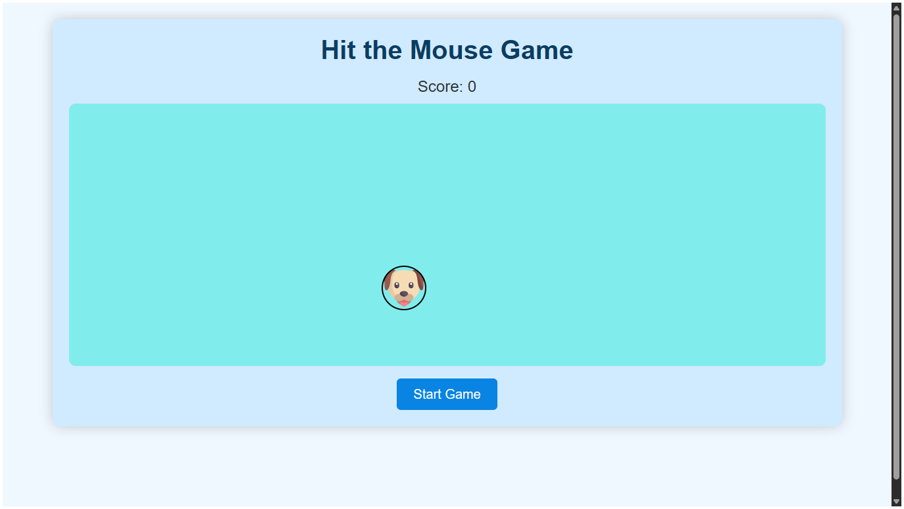

# Hit the Mouse Game

## Live Demo

Try the game live at:  
[https://mdmohsinhaider.github.io/Hit-the-Mouse-Game/](https://mdmohsinhaider.github.io/Hit-the-Mouse-Game/)

---

## About the Game

**Hit the Mouse** is a simple, interactive web game where the player's goal is to hit (click) the mouse icons that randomly appear on the screen within a limited time frame. The game is designed using HTML, CSS, and JavaScript, focusing on quick reflexes and accuracy.

When the game starts, mice pop up at random positions inside the game area. Each mouse stays visible for one second. Players have to click on the mice before they disappear to increase their score. The game challenges reaction time and hand-eye coordination.

---

## How to Play

- Click the **Start Game** button to begin.
- Once started, multiple mouse icons will appear at random positions on the game area.
- Each mouse stays visible for 1 second.
- Click on the mouse before it disappears to score a point.
- The score updates immediately on each successful hit.
- The **Start Game** button changes to a **Reset** button during the game.
- Click the **Reset** button anytime to restart the game and reset the score.

---

## Game Rules and Mechanics

- Mice randomly spawn every 1.2 seconds within the game area.
- Each mouse stays for exactly 1 second unless clicked.
- Missing to click a mouse before it disappears results in no points.
- Clicking a mouse removes it immediately from the screen and adds 1 to the score.
- The game continues indefinitely until manually reset by the player.
- Score only increments by 1 per mouse clicked.
- The game area is responsive to different screen sizes for optimal play on various devices.

---

## History of the Game

The concept of "Hit the Mouse" is inspired by the classic "Whac-A-Mole" arcade game, which originated in the 1970s. This genre became popular due to its simple yet addictive gameplay, challenging players to hit randomly appearing targets quickly to score points. This web adaptation brings the excitement to browser environments with intuitive mouse interactions and responsive design for modern devices.

---

## Future Development

Planned improvements for future versions include:  
- Adding a countdown timer for timed rounds.  
- Levels with increasing difficulty (faster mouse spawn and shorter visibility).  
- Sound effects and animation for hits and misses.  
- Leaderboards to track high scores globally.  
- Mobile touch support enhancements.  
- Visual themes and customization options.

---

## Developer Details

Md Mohsin Haider  
Software Developer | Web & Game Enthusiast  
Email: [YourEmail@example.com]  
GitHub: [github.com/mdmohsinhaider](https://github.com/mdmohsinhaider)  
LinkedIn: [linkedin.com/in/mdmohsinhaider](https://linkedin.com/in/mdmohsinhaider)

---

## Acknowledgements

- Mouse icon by Flaticon (https://www.flaticon.com/free-icon/mouse_616408)  
- Inspired by classic arcade games of the 20th century

---

## License

This project is open-sourced under the MIT License.

---

Feel free to fork, contribute, and improve the game!  
Enjoy hitting the mice and sharpening your reflexes!

---

*Screenshots included show the game before start (Screenshot1.png) and after start with mice appearing randomly (Screenshot2.png).*
